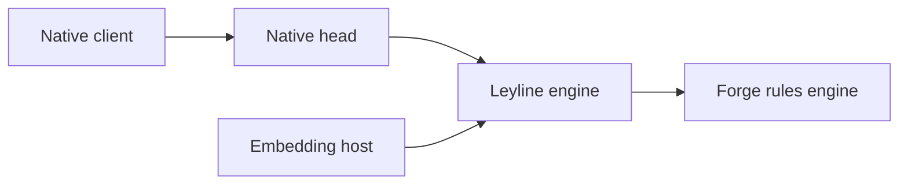

# Leyline

Open-source local playtesting server built around a client protocol bridge and
the [Forge](https://github.com/Card-Forge/forge) rules engine.

Leyline exposes a native-client-compatible head and a transport-neutral match
runtime for in-process embedding.



Forge owns game rules and legality. Leyline translates between synchronous
engine decisions and asynchronous protocol interactions, then projects engine
state into client-facing updates.

[Architecture deep dive →](docs/architecture.md)

## Fork notice

This repository is an independently maintained downstream fork of
[delebedev/leyline](https://github.com/delebedev/leyline). It retains the
upstream project's Forge-backed local protocol bridge and periodically merges
upstream changes.

In addition to upstream, this fork focuses on making complete local native
client play sessions work in practice. Its fork-specific work includes:

- local account, lobby, matchmaking, and match transports, including
  authenticated two-player local games and Linux/Proton support;
- expanded client-state projection and interactive decision handling for
  casting, payments, targeting, priority, triggers, zones, and the stack;
- local card metadata and SQLite-backed lookup, current protocol/schema
  alignment, and draft-model experimentation; and
- puzzle-backed acceptance coverage for client-visible gameplay flows.

This fork is not maintained by or on behalf of the upstream project. Issues
specific to these changes belong here; focused, generally useful changes may
be suitable for contribution to
[delebedev/leyline](https://github.com/delebedev/leyline).

## Repository shape

```text
app/         Composition root, local control, and management
domain/      Shared domain model, services, and repository ports
engine/      Forge adapter, match runtime, and state projection
proto/       Generated GRE schema (submodule + rename map → protoc)
native/      Native account, lobby, and match transports
forge/       Forge submodule
```

## Build and run

```bash
git clone --recursive https://github.com/delebedev/leyline.git
cd leyline
just bootstrap
just serve
```

Requires JDK 21+, [just](https://github.com/casey/just), and macOS or Linux.
End-to-end native-client play needs a compatible client installed separately
and the local setup described in
[`docs/local-client-setup.md`](docs/local-client-setup.md).

## Test

```bash
just test-gate                 # formatting and repository test gate
just test-one MyTest engine   # one focused test class
just puzzle-check file.pzl    # validate a puzzle fixture
```

Puzzle-backed scripted suites exercise complete gameplay paths. See
[`docs/puzzle-harness.md`](docs/puzzle-harness.md) for fixture boundaries.

## Design stance

- **Playable behavior first.** A change is complete when its user-facing path
  works, not merely when a lower layer compiles.
- **Forge owns rules.** Leyline adds narrow integration seams instead of
  duplicating game logic.
- **Explicit boundaries.** Live Forge handles stay in the imperative shell;
  projection consumes immutable values.
- **Local interoperability.** The project implements client-compatible
  protocols without distributing client assets.

## Scope

Leyline is a local server for personal playtesting and protocol/runtime
experimentation. It is not a public or hosted game service and does not
distribute card art, sounds, or other game assets.

## License

GPL-3.0, inherited from Forge. See [LICENSE](LICENSE), [LEGAL](LEGAL.md), and
[NOTICE](NOTICE).

[Architecture](docs/architecture.md) · [Security](SECURITY.md) ·
[Contributing](CONTRIBUTING.md)

---

This project is not affiliated with, endorsed by, or connected to Wizards of
the Coast, Hasbro, or any of their affiliates. "Magic: The Gathering" is a
trademark of Wizards of the Coast LLC.
