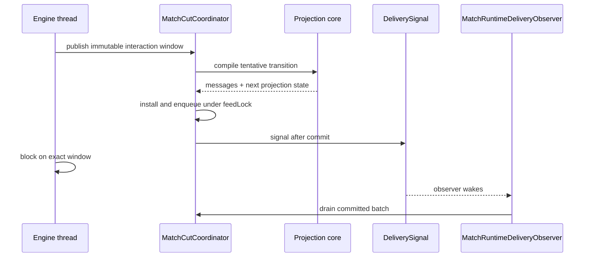

# Bridge Threading

This document owns the cross-class execution and ordering constraints that the
type system does not express. System shape lives in
[`architecture.md`](architecture.md); durable direction and rationale live in
[ADR 0015](decisions/0015-functional-core-imperative-shell.md).

## Execution domains

| Domain | Runs | Coordination |
|---|---|---|
| Engine thread | Forge loop, callbacks, event dispatch, safe-point cut commits | Sole owner of the live Forge graph |
| Interactive entrants | Native and in-process host input and tests | `ConnectionState.sessionLock` serializes `MatchSession` entry |
| Runtime delivery observer | One per live human `MatchConnection` | Waits for coordinator feed notifications, then enters `sessionLock` to drain |
| Spectator pump | Drains its viewer feed and delivers committed output | Coordinator `feedLock` protects publication/drain |
| Sink caller | Observes committed prompt metadata and calls `MessageSink.send` | Runs on the initiating session or pump domain |

Engine confinement makes a live read physically stable only on the engine
thread. It does not make an event callback a safe projection boundary because a
callback can run inside a larger mutation burst.

## Mutable-state ownership

| Mutable place | Owner |
|---|---|
| Live Forge graph | Engine thread |
| Retained executable handles | Owning family runtime under `feedLock`; sessions receive only exact claims or immutable values |
| Client settings and priority presentation policy | One `PriorityPolicyRuntime` per interactive seat |
| Interaction correlation, committed viewer feeds, and terminal failure | `MatchCutCoordinator` and its family runtimes under `feedLock` |
| Client-facing identities, cursors, annotations, and logical output | One committed `ProjectionState` behind `GameBridge.projectionLock` |
| Per-connection admission and delivery | `ConnectionState.sessionLock` |

Session handlers parse client messages into immutable values. They do not read
the live Forge graph to reconstruct an action, combat declaration, prompt
answer, or priority decision.

## Lock order

The acquisition order is:

1. `sessionLock`, when a connection is admitting or delivering work;
2. coordinator `feedLock`, for interaction state, cut preparation, installation,
   and committed feeds;
3. `projectionLock`, briefly, for the revision-checked `ProjectionState` swap.

`feedLock` may be acquired without `sessionLock`. No path acquires `feedLock`
while holding `projectionLock`, and no drainer waits for the engine while holding
`feedLock`.

Drainers and event subscribers requesting a future cut use `feedLock`.
Action-window visibility and prompt correlation may be read without `feedLock`
from volatile state written while holding it. Those reads are observation only;
they do not claim or complete a window.

Read-only runtime advice enters through the owning match handle and then the
human session's `sessionLock`. The engine is already blocked on the published
prompt while Forge AI inspects the game. Each session shares one serialized
proposal service with autonomous delivery because both temporarily use the same
Forge controller slot. The caller checks the prompt identity again after the
consult and returns an unavailable proposal if it changed. This path never
holds `feedLock` and never submits a response.

## Publication transaction

When the engine blocks for a visible decision, the delivery signal means the
complete interaction batch is already committed and drainable:

Under `feedLock`, a prepared cut enqueues all viewer batches, installs its
projection transition under `projectionLock`, runs its install callbacks,
acknowledges any playback boundary, and only then signals delivery. Replacement
batches supplied to the installer are retired after enqueue and restored on a
pre-install failure. That failure removes only the new cut's batches. Once
projection installs, allocation and publication are not rewound. Committed
logical identifiers and output ordinals remain monotonic; sessions and
transports may read their horizons but cannot allocate them.

Settings acknowledgements and concession are session-triggered coordinator
publications. Settings acknowledgement uses no Forge state. The concession
outcome is a value derived from stable seats and the client command, while its
publication materializes current Forge state on the session caller. Both use
the ordered cut transaction under `sessionLock` then `feedLock`; neither
advances Forge. These paths are shell integration exceptions to the default
engine-thread owner.

Every coordinator-backed interaction preserves these rules:

1. Freeze projection values and exact executable handles on the engine thread.
2. Commit the complete state-and-request batch before signalling.
3. Correlate answers to the exact request message and game-state identifiers.
4. Resolve original handles only within the owning runtime.
5. Retire response, timeout, supersession, and teardown through one winner.
6. Treat materialization, install, or delivery failure as terminal when Forge
   cannot safely continue past the unpublished boundary.

Some interactions accept an ordinary default on choice timeout. That is a
prompt policy, not permission to continue after failed publication.

A synchronous default path publishes no window and therefore emits no signal.
Priority `Skip` likewise closes no journal and allocates no protocol state.

## Delivery limits

Projection and delivery have separate timelines:

| Timeline | Advances when | Meaning |
|---|---|---|
| Projection state and viewer cursor | A complete transition installs | Baseline for the next compile |
| Committed feed | The fixed batch is enqueued | Batch may be drained |
| Sink handoff | `MessageSink.send` is invoked successfully | Server delivery attempt, not client acknowledgement |

Never use a viewer cursor as client-awareness state. If behavior depends on
delivery, represent delivery explicitly.

`MatchRuntimeContinuation` waits for one engine horizon, drains committed batches
in order, and acknowledges an exact `SYNC_ONLY` barrier only after successful
delivery. An iterative response that does not release the engine does not wait
for another horizon.

The inbound handler drains the horizon released by its accepted response while
holding `sessionLock`. The connection's delivery observer handles horizons
published after that handler returns by taking the same lock and using the same
drain path. The observer consumes only the coordinator delivery notification; it
does not submit actions or choose progression policy.

In-process harness callers may wait for named sink output, but do not wait on an
engine horizon or consume the observer notification. Player, Familiar, and
spectator sessions are delivery-only at the terminal horizon: they drain and
deliver their own committed viewer feed and do not derive terminal state from
Forge. Raw match completion is connection-local and follows the committed
terminal drain. In a two-human match, each session delivers its own terminal
feed and completion message before the shared match is torn down. Neither
session calls into the other session while holding its connection lock.

Two-human matches retain one rules engine, coordinator lock, event journal,
and projection state. Action and prompt runtimes are bound to an explicit
seat. A decision cut gives the chooser the Player role and the other human
the SeatObserver perspective: their own private cards remain visible, while
the chooser's actions and private prompt overlays are absent. Both players
retain independent response and delivery boundaries.

The shared playback journal only owns event capture and frame acknowledgement;
each connection drains its own coordinator feed. Engine horizon notifications
use a generation broadcast with a cursor for each waiting thread, so one
connection cannot consume the other connection's wake-up.

Constructed two-human startup waits until both authenticated seat sessions
have received their initial lifecycle state. Forge's sequential mulligan
callbacks publish each player's seven-card keep request from the engine thread.
A Mull decision redraws seven and publishes another keep request. Once the
player keeps, a separate tuck request selects one bottom card per previous
mulligan. Network handlers submit the exact pending answer and return; they do
not wait for the other player's mulligan. Bot matches retain their automatic
Familiar startup.

### Reconnect publication

An immediate constructed reconnect may re-enqueue its missing initial viewer
batch under `feedLock` with the original output ordinal and logical identifiers.
It does not duplicate a batch already queued or install another projection
transition.

After any later output commits, reconnect instead installs one new cut for only
the returning viewer. That cut carries a current Full state and, when one is
published, the retained exact action horizon with fresh monotonic message and
game-state identifiers. The action runtime rebinds response correlation only
after a replacement horizon installs. Other viewer feeds are not rebuilt or
redelivered.

Mulligan remains a pre-game execution-domain exception: it drives an engine
interaction outside `sessionLock`. Redraw identity and lifecycle output commit
together through one coordinator lifecycle cut.

## Teardown

Connection teardown stops and invalidates its delivery observer before the
connection can be rebound. Puzzle replacement invalidates the old generation,
publishes and delivers the replacement's initial horizon under `sessionLock`,
then arms a new observer generation.

Match teardown removes registered connections and sessions, closes session-owned
workers, detaches connection state, and closes the match. Bridge shutdown
terminalizes coordinator waiters, rejects later cuts, wakes delivery and engine
waiters, stops the game loop, and discards registered viewer feeds including any
committed but undrained batches.

## Safe points and event subscribers

Forge EventBus subscribers execute synchronously on the engine thread, often in
the middle of the operation that raised the event. Ordinary subscribers append
immutable facts and request a cut. They must not:

- inspect Forge for projection after handing work to another thread;
- close the journal or compile a frame;
- allocate protocol identities;
- install, enqueue, deliver, sleep, or wait on external work.

`PhaseHandler` invokes the ordinary completion hook after a successful
`mainLoopStep` mutation burst. Narrow completion hooks own attacker declaration,
blocker declaration, and combat teardown cuts. A combat journal may yield
several ordered frames, but the pending cut compiles them as one private fold
and installs only the final combined transition.

A failed or stale install is not rebuilt from a newer live snapshot. It retains
the immutable cut and terminates the path because rebasing would change the
facts that were originally closed.

## Pre-mutation prompts

Forge can ask for input before performing a mutation that the client must
already present. Such prompts use explicit projection supplements: materialize the
intended state, commit it with the request, then reconcile it after Forge
resumes. The supplement is a value owned by the prompt runtime; it is not a
reason to mutate projection state outside compilation.
